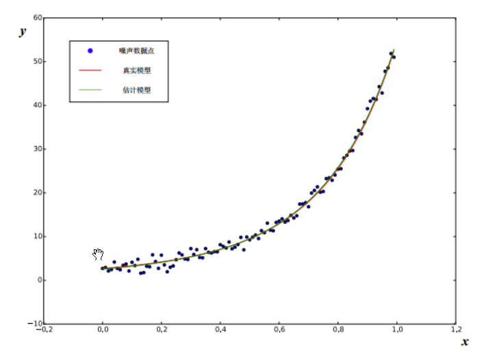
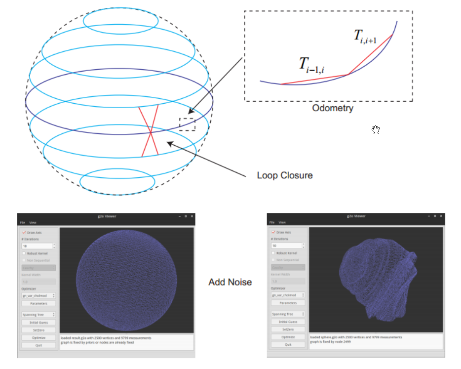

# 非线性优化方法

- 梯度下降法
- 高斯牛顿法
- LM方法
- 线搜索法

# 优化库

- Ceres-2.2.0

- G2O-20241228_git

- GTSAM-4.2.0

# 示例

## 拟合曲线

假设有一条满足以下方程的曲线:
$$
y = exp(ax^2 + bx + c) + w
$$
其中 *a, b, c* 为曲线的参数， *w* 为高斯噪声。现在，假设我们有 *N* 个关于 *x, y* 的观测数据点，想根据这些数据点求出曲线的参数。那么，可以求解下面的最小二乘问题以估计曲线参数：
$$
\underset{a,b,c}{min} \frac{1}{2}\sum_{i=1}^{N}\left\| y_i - exp(ax_{i}^{2} + bx_{i} + c) \right\|^2
$$
待估计的变量是 *a, b, c*，而不是 *x*。我们写一个程序，先根据模型生成 *x, y* 的真值，然后在真值中添加高斯分布的噪声。

## 位姿图优化

原始位姿图是由 g2o 自带的 create sphere 程序仿真生成的。它的真实轨迹为一个球，由从下往上的多个层组成。每层为一个正圆形，很多个大小不一的圆形层组成了一个完整的球体，共包含 2500 个位姿节点，可以看成一个转圈上升的过程。然后，仿真程序生成了 *t* *−* 1 到 *t* 时刻的边，称为 odometry 边（里程计）。此外，又生成层与层之间的边，称为 loop closure。随后，在每条边上添加观测噪声，并根据里程计边的噪声，重新设置节点的初始值。这样，就得到了带累计误差的位姿图数据。

位姿用节点表示，帧间位姿观测约束、闭环观测约束用边表示，以位姿流形形式进行优化（不使用四元数、欧拉角等形式），得到优化后的位姿。

# 参考

- 视觉SLAM十四讲